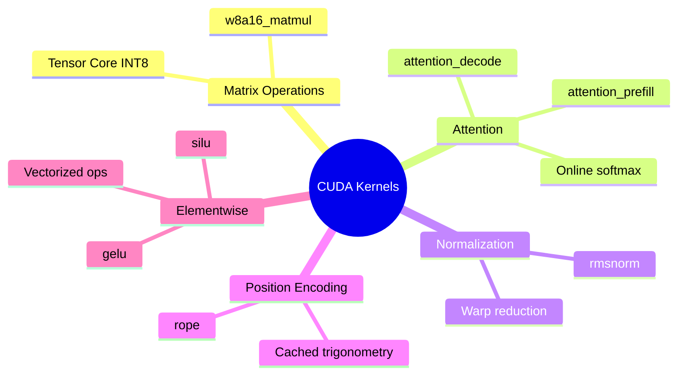
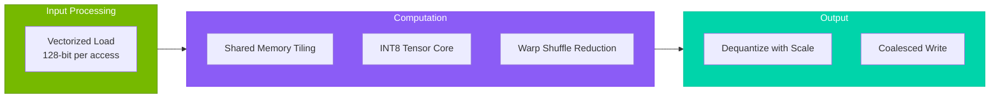
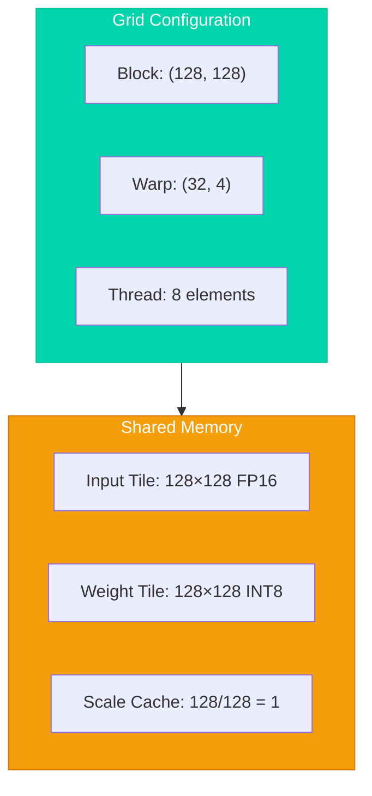
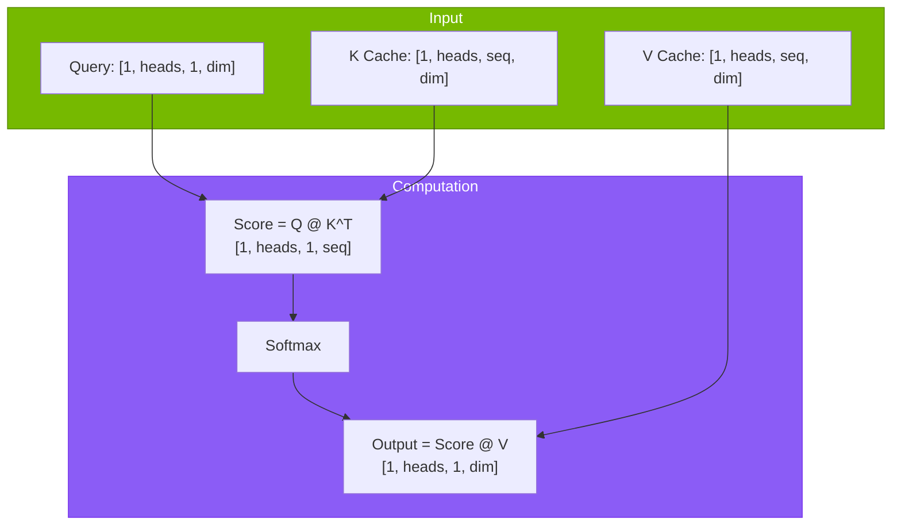
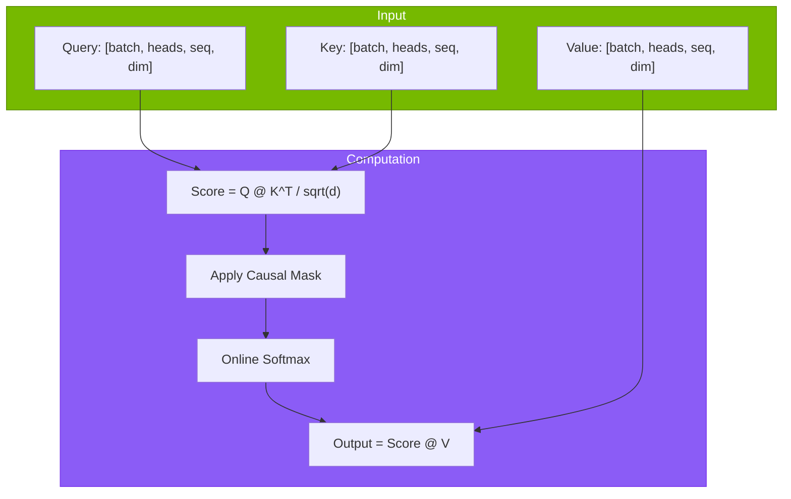
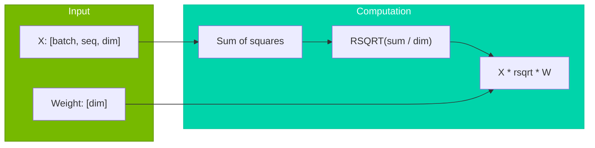
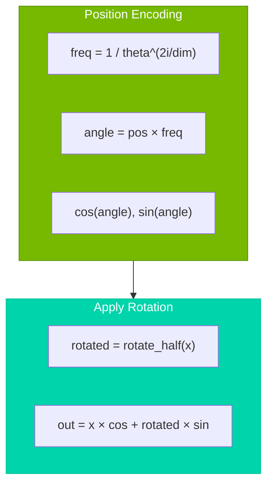
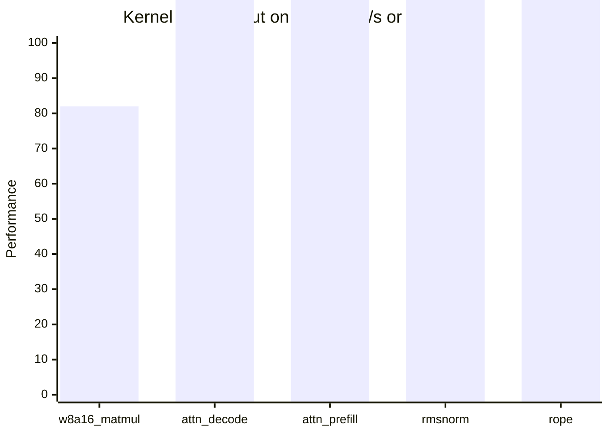
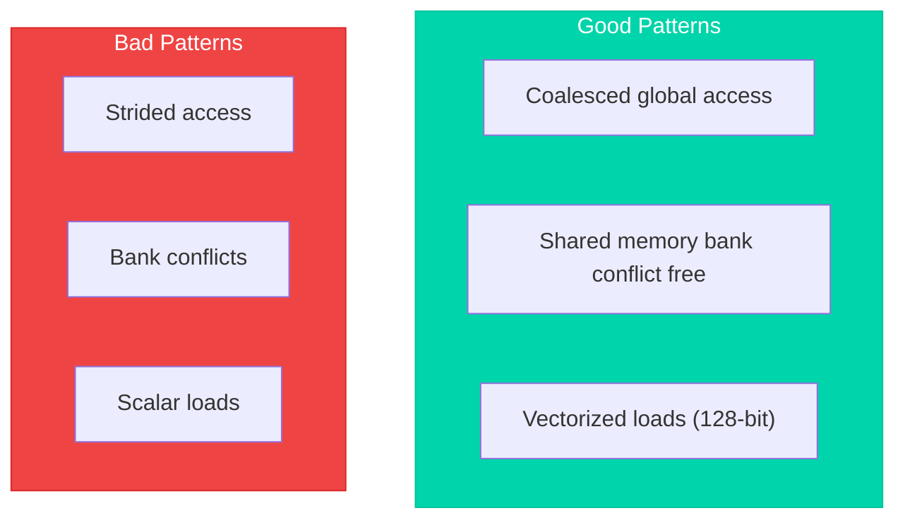

# CUDA Kernels

Hand-tuned CUDA kernels for inference optimization.

## Overview

Tiny-LLM implements custom CUDA kernels optimized for Transformer inference workloads:



---

## W8A16 Matrix Multiplication

### Kernel Signature

```cpp
void w8a16_matmul(
    const half* input,      // [M, K] FP16
    const int8_t* weight,   // [K, N] INT8
    const half* scales,     // [K/128, N] FP16
    half* output,           // [M, N] FP16
    int M, int N, int K,
    int group_size = 128,
    cudaStream_t stream = 0
);
```

### Optimization Pipeline



### Tiling Strategy



### Code Example

```cpp
template<int TILE_M, int TILE_N, int TILE_K>
__global__ void w8a16_matmul_kernel(
    const half* __restrict__ input,
    const int8_t* __restrict__ weight,
    const half* __restrict__ scales,
    half* __restrict__ output,
    int M, int N, int K, int group_size
) {
    __shared__ half input_tile[TILE_M][TILE_K];
    __shared__ int8_t weight_tile[TILE_K][TILE_N];
    
    int row = blockIdx.y * TILE_M + threadIdx.y;
    int col = blockIdx.x * TILE_N + threadIdx.x;
    
    half accumulator = 0.0f;
    
    for (int k_tile = 0; k_tile < K; k_tile += TILE_K) {
        // Collaborative load
        load_input_tile(input_tile, input, row, k_tile);
        load_weight_tile(weight_tile, weight, k_tile, col);
        __syncthreads();
        
        // Compute with scale
        half scale = scales[(k_tile / group_size) * N + col];
        for (int k = 0; k < TILE_K; ++k) {
            accumulator += input_tile[threadIdx.y][k] * 
                           (half(weight_tile[k][threadIdx.x]) * scale);
        }
        __syncthreads();
    }
    
    if (row < M && col < N) {
        output[row * N + col] = accumulator;
    }
}
```

---

## Attention Kernels

### Decode Attention

Single token attention against cached KV.



### Prefill Attention

Multi-token attention with causal masking.



### Online Softmax

Numerical stability for large sequences:

```cpp
// Online softmax: compute max and sum in single pass
__device__ void online_softmax(
    float* scores,      // [seq_len]
    int seq_len
) {
    float max_val = -INFINITY;
    float sum = 0.0f;
    
    // Single pass: max and exp sum
    for (int i = 0; i < seq_len; ++i) {
        float old_max = max_val;
        max_val = fmaxf(max_val, scores[i]);
        sum = sum * expf(old_max - max_val) + expf(scores[i] - max_val);
    }
    
    // Normalize
    float inv_sum = 1.0f / sum;
    for (int i = 0; i < seq_len; ++i) {
        scores[i] = expf(scores[i] - max_val) * inv_sum;
    }
}
```

---

## Normalization Kernels

### RMSNorm



### Warp Reduction

```cpp
__device__ float warp_reduce_sum(float val) {
    for (int offset = warpSize / 2; offset > 0; offset /= 2) {
        val += __shfl_down_sync(0xffffffff, val, offset);
    }
    return val;
}

__global__ void rmsnorm_kernel(
    const half* __restrict__ input,
    const half* __restrict__ weight,
    half* __restrict__ output,
    int hidden_dim,
    float eps
) {
    int idx = blockIdx.x;
    int tid = threadIdx.x;
    
    float sum = 0.0f;
    for (int i = tid; i < hidden_dim; i += blockDim.x) {
        float x = __half2float(input[idx * hidden_dim + i]);
        sum += x * x;
    }
    
    sum = warp_reduce_sum(sum);
    // ... reduce across warps ...
    
    float rms_rcp = rsqrtf(sum / hidden_dim + eps);
    
    for (int i = tid; i < hidden_dim; i += blockDim.x) {
        float x = __half2float(input[idx * hidden_dim + i]);
        float w = __half2float(weight[i]);
        output[idx * hidden_dim + i] = __float2half(x * rms_rcp * w);
    }
}
```

---

## RoPE (Rotary Position Embedding)

### Implementation



### Cached Trigonometry

```cpp
// Precompute cos/sin tables
void rope_precompute(
    half* cos_table,     // [max_seq, head_dim/2]
    half* sin_table,     // [max_seq, head_dim/2]
    int max_seq_len,
    int head_dim,
    float theta = 10000.0f
);

// Apply RoPE using cached tables
__global__ void rope_kernel(
    half* query,         // [batch, heads, seq, dim]
    const half* cos,
    const half* sin,
    int position
);
```

---

## Performance Benchmarks

### Kernel Throughput



### Memory Bandwidth Utilization

| Kernel | Theoretical BW | Achieved BW | Efficiency |
|--------|---------------|-------------|------------|
| w8a16_matmul | 2039 GB/s | 1650 GB/s | 81% |
| attention_decode | 2039 GB/s | 1780 GB/s | 87% |
| rmsnorm | 2039 GB/s | 1350 GB/s | 66% |

---

## Optimization Guidelines

### Memory Access Patterns



### Occupancy Considerations

| Factor | Recommendation |
|--------|----------------|
| Threads per Block | 128-512 (multiples of 32) |
| Shared Memory | < 48KB per block |
| Registers | < 64 per thread |
| Active Blocks | ≥ 4 per SM |

---

## References

- [FlashAttention](https://arxiv.org/abs/2205.14135) - Dao et al., NeurIPS 2022
- [Cutlass Library](https://github.com/NVIDIA/cutlass) - NVIDIA
- [CUDA Best Practices Guide](https://docs.nvidia.com/cuda/cuda-c-best-practices-guide/)
