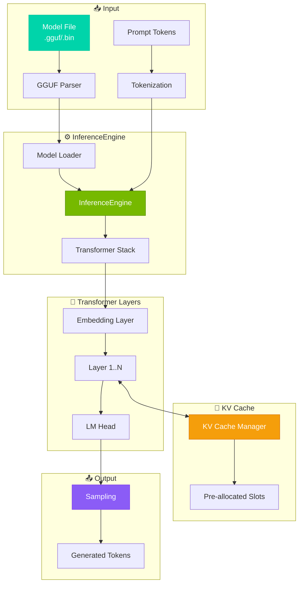
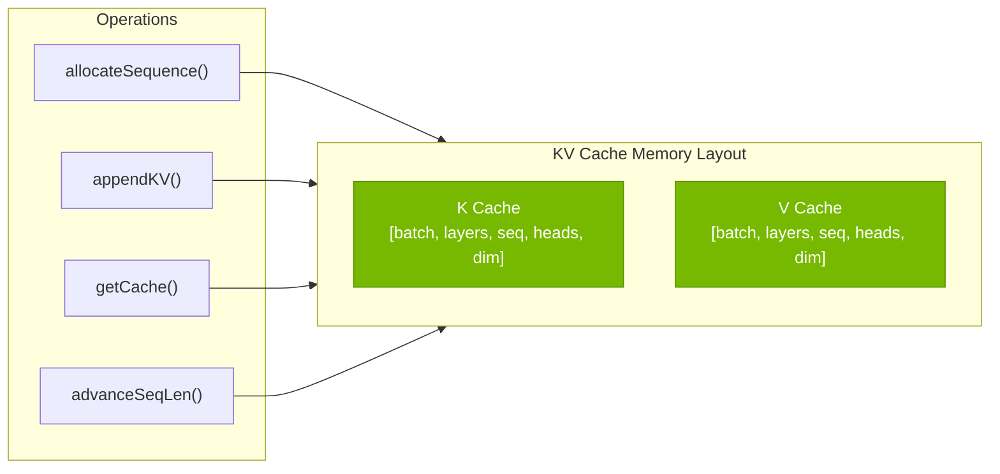
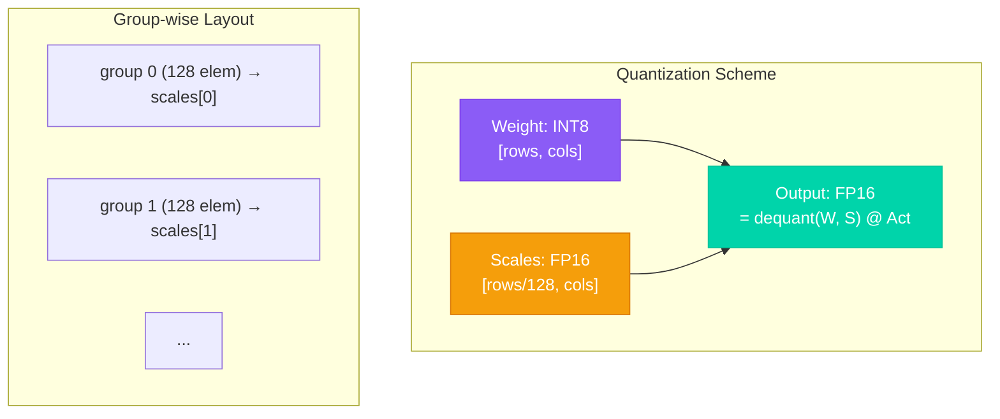
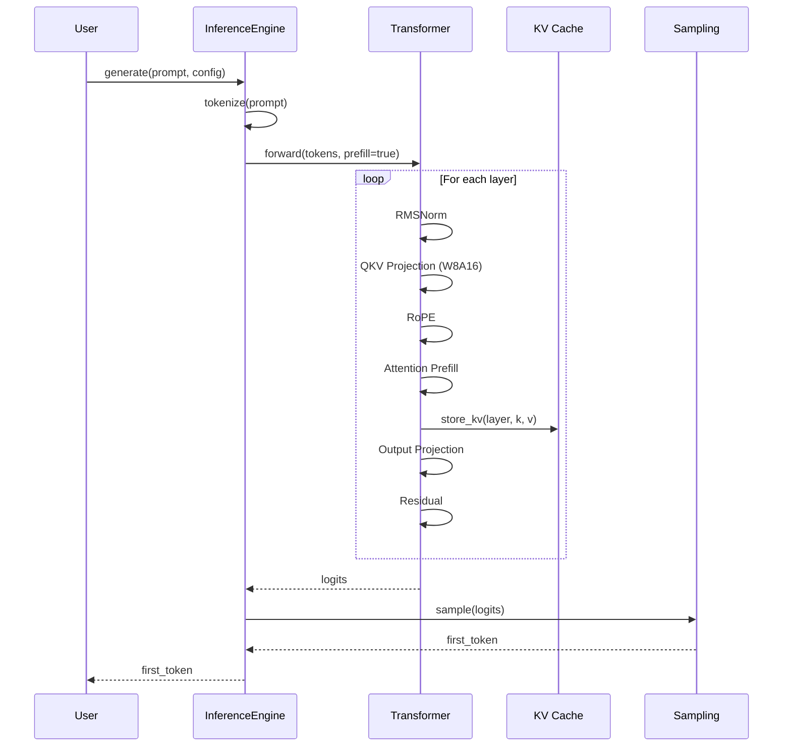
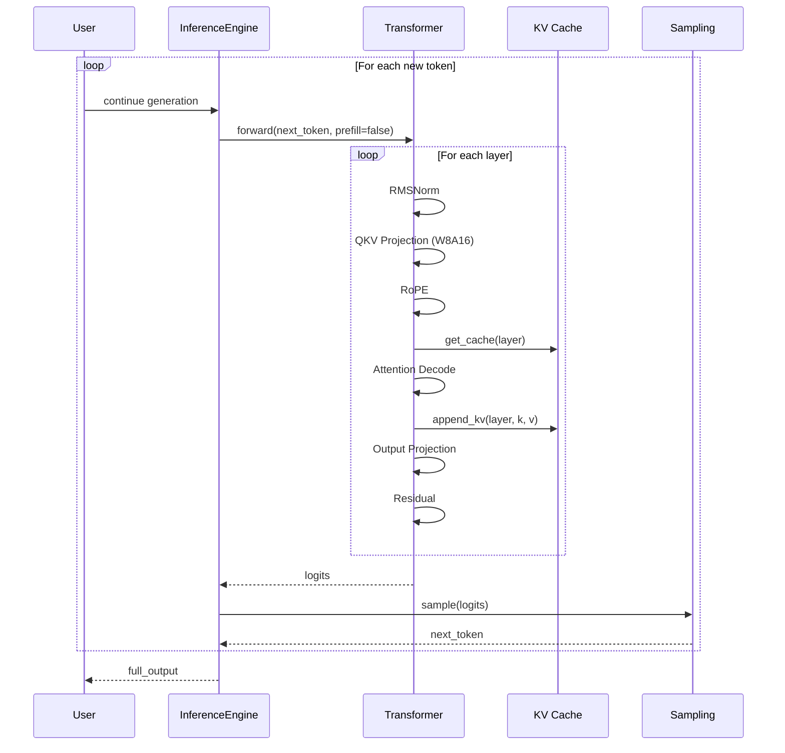
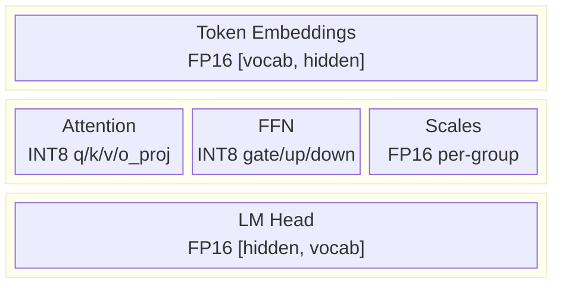
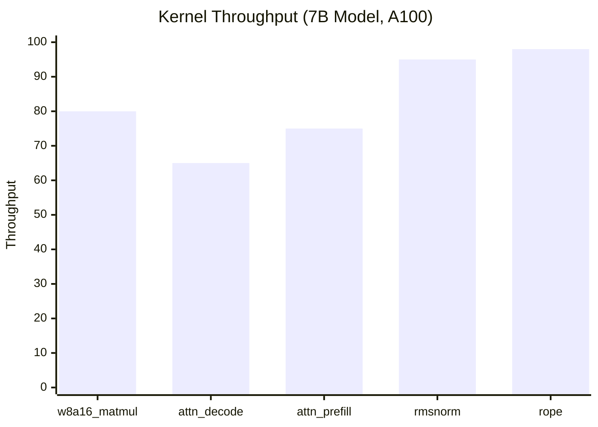
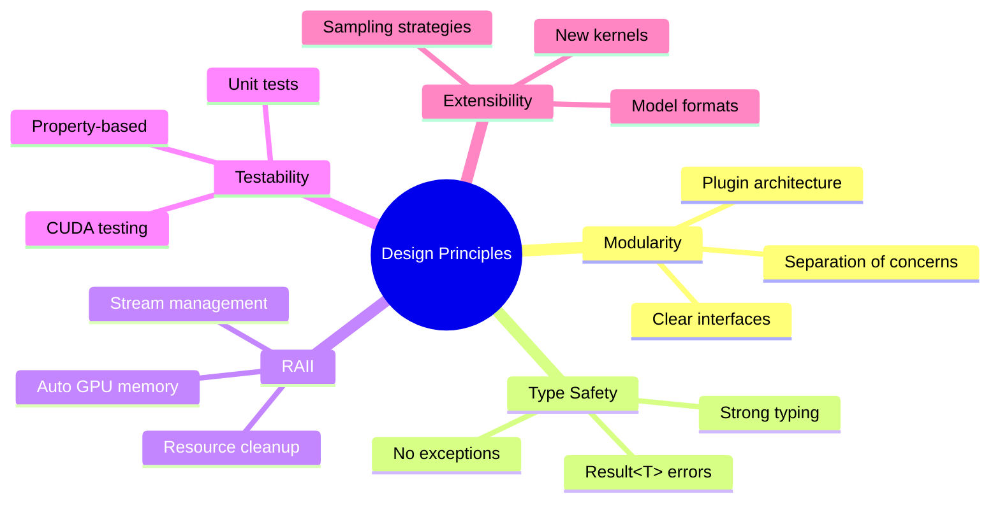

# Architecture Overview

System architecture and design documentation for Tiny-LLM inference engine.

## Overview

Tiny-LLM is a high-performance CUDA C++ inference engine designed for efficient Transformer model inference. It focuses on:

| Feature | Technology | Benefit |
|---------|------------|---------|
| **W8A16 Quantization** | INT8 weights + FP16 activations | ~50% memory reduction |
| **Efficient KV Cache** | Incremental decoding with sequence management | O(1) autoregressive step |
| **Optimized Kernels** | Tensor Core INT8, shared memory tiling | Maximum throughput |
| **Modular Design** | Clean separation of concerns | Easy to extend and test |

---

## System Architecture



---

## Core Components

### 1. InferenceEngine

The main entry point for model inference.

```cpp
class InferenceEngine {
public:
    // Load model from disk
    static Result\<std::unique_ptr\<InferenceEngine\>\> load(
        const std::string& path, const ModelConfig& config);
    
    // Complete generation pipeline
    std::vector<int> generate(
        const std::vector<int>& prompt, 
        const GenerationConfig& config);
    
    // Statistics and profiling
    const GenerationStats& getStats() const;
    void resetStats();
};
```

**Key Responsibilities**:
- Model lifecycle management
- Prefill/decode orchestration
- Token sampling and generation loop
- Performance profiling

### 2. KV Cache Manager

Efficient key-value cache for autoregressive generation.



### 3. W8A16 Quantization

Weight-only INT8 quantization with FP16 activations.



**Benefits**:
- 50% weight memory reduction
- No activation quantization (maintains precision)
- Efficient INT8 Tensor Core utilization on Ampere+

---

## Data Flow

### Prefill Phase (Prompt Processing)



### Decode Phase (Token Generation)



---

## Memory Layout

### Weight Storage



### Activation Buffers

| Buffer | Shape | Dtype | Size (B=1, S=2048, H=4096) |
|--------|-------|-------|---------------------------|
| Hidden States | [B, S, H] | FP16 | 16 MB |
| Attention Output | [B, heads, S, head_dim] | FP16 | 16 MB |
| QKV | [B, S, 3×H] | FP16 | 48 MB |
| FFN Intermediate | [B, S, intermediate_dim] | FP16 | 44 MB |

---

## Performance Optimizations

### Memory Optimizations

| Technique | Implementation | Benefit |
|-----------|----------------|---------|
| W8A16 Quantization | Per-group INT8 weights + FP16 scales | 50% weight memory |
| KV Cache Paging | Pre-allocated with sequence management | Efficient batching |
| Activation Reuse | In-place operations | Reduced allocations |

### Compute Optimizations

| Technique | Application | Speedup |
|-----------|-------------|---------|
| Tensor Cores | INT8 matmul on Ampere+ | 2-4× vs FP16 |
| Warp Shuffle | Reductions | Eliminates shared memory |
| Vectorized Loads | 128-bit memory access | Better bandwidth |
| Kernel Fusion | RMSNorm+Resid, SiLU+Mul | Reduced kernel launch |

### Optimized Kernel Performance



---

## Design Principles



---

## Next Steps

- [Quantization Details](./quantization) - Deep dive into W8A16 implementation
- [KV Cache](./kv-cache) - Cache management strategies
- [CUDA Kernels](./cuda-kernels) - Kernel optimization techniques
- [API Reference](../api/inference-engine) - Complete API documentation
