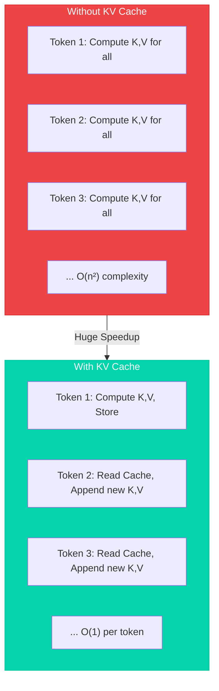
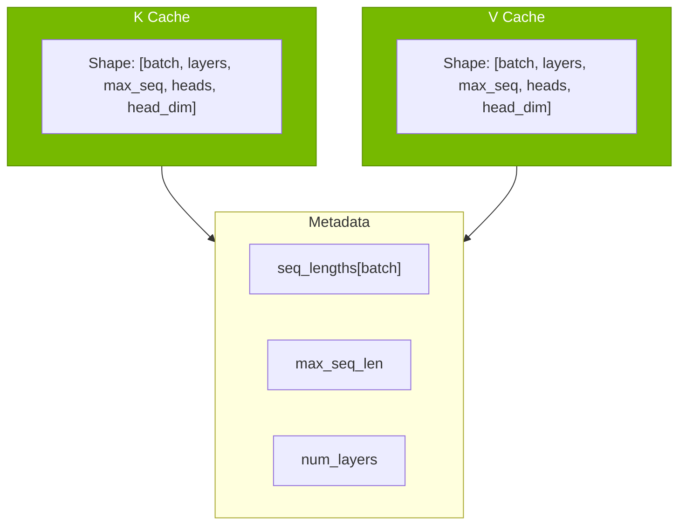
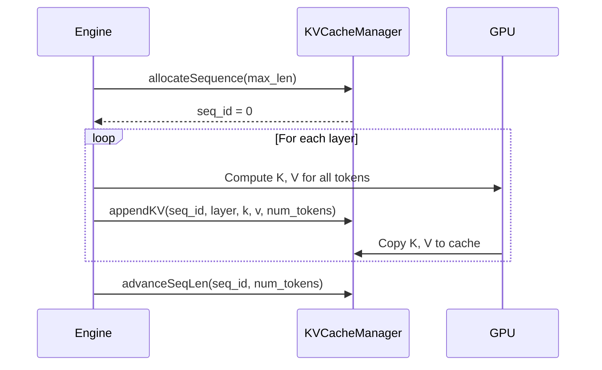
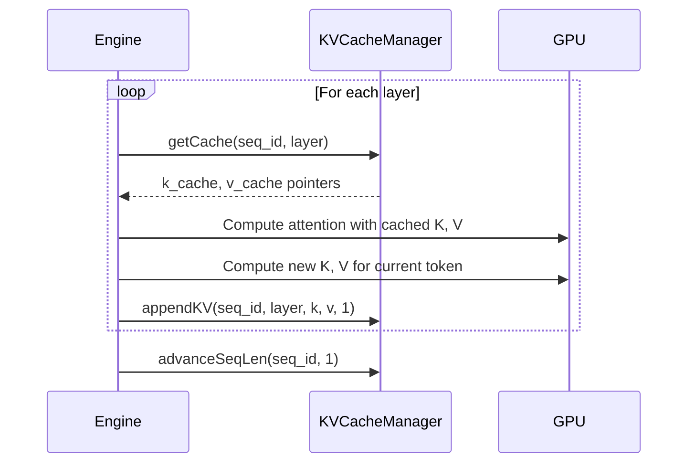
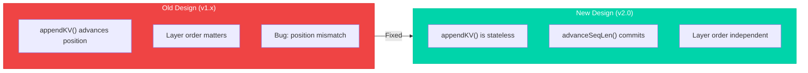
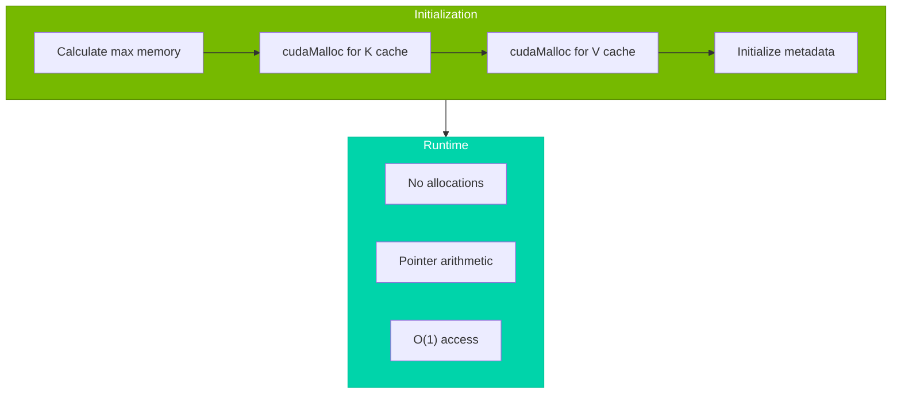
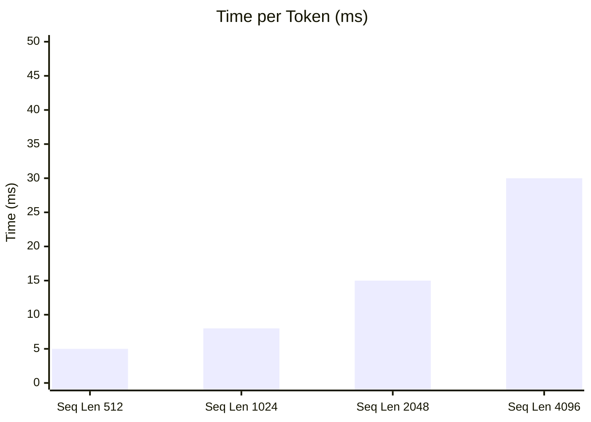
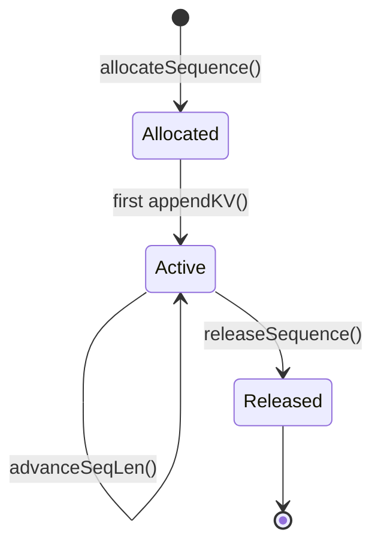

# KV Cache Management

Efficient key-value cache for autoregressive generation.

## Overview

The KV Cache stores key and value tensors from previous attention computations, enabling O(1) incremental decoding instead of O(n²) full recomputation.



---

## Memory Layout

### Cache Structure



### Memory Calculation

For a 7B model with batch_size=1, max_seq_len=4096:

```
K Cache: 1 × 32 × 4096 × 32 × 128 × 2 bytes = 1 GB
V Cache: 1 × 32 × 4096 × 32 × 128 × 2 bytes = 1 GB
Total: 2 GB
```

---

## API Reference

### KVCacheManager Class

```cpp
class KVCacheManager {
public:
    // Constructor: pre-allocate cache slots
    KVCacheManager(
        int max_batch_size,
        int num_layers,
        int max_seq_len,
        int num_kv_heads,
        int head_dim,
        cudaStream_t stream = 0
    );

    // Allocate a new sequence slot
    Result\<int\> allocateSequence(int max_len);

    // Release a sequence slot
    void releaseSequence(int seq_id);

    // Append KV for a specific layer (stateless)
    void appendKV(
        int seq_id,
        int layer_idx,
        const half* k,           // [num_tokens, heads, head_dim]
        const half* v,
        int num_tokens,
        cudaStream_t stream = 0
    );

    // Advance sequence length after all layers
    void advanceSeqLen(int seq_id, int num_tokens);

    // Access cached K/V for attention computation
    std::pair<half*, half*> getCache(int seq_id, int layer_idx);

    // Get current sequence length
    int getSeqLen(int seq_id) const;
};
```

---

## Usage Patterns

### Prefill Phase



### Decode Phase



---

## Design Evolution

### v2.0 Redesign

The v2.0 redesign fixed a critical issue where layer order affected write positions.



### Stateless appendKV

```cpp
// v2.0: appendKV doesn't advance position
cache.appendKV(seq_id, layer_idx, k, v, num_tokens);
// Position is determined by current seq_len, not by write count

// Explicit commit after all layers
cache.advanceSeqLen(seq_id, num_tokens);
```

---

## Memory Management

### Pre-allocation Strategy



### Memory Pool

```cpp
// Pre-allocate at initialization
size_t cache_size = max_batch_size * num_layers * max_seq_len 
                  * num_kv_heads * head_dim * sizeof(half);

half* k_cache_pool;
half* v_cache_pool;
cudaMalloc(&k_cache_pool, cache_size);
cudaMalloc(&v_cache_pool, cache_size);

// O(1) access during inference
half* get_k_cache(int seq_id, int layer, int pos) {
    return k_cache_pool + 
           (seq_id * num_layers + layer) * max_seq_len * heads * dim +
           pos * heads * dim;
}
```

---

## Performance Considerations

### Memory Bandwidth

KV Cache access is memory-bandwidth bound. Optimizations:

| Technique | Implementation | Benefit |
|-----------|----------------|---------|
| Coalesced Access | Contiguous memory layout | Maximum bandwidth |
| Pointer Caching | Cache pointers per layer | Reduced arithmetic |
| Async Copy | cudaMemcpyAsync | Overlap with compute |

### Cache vs Recompute Trade-off



---

## Multi-Sequence Support

### Batch Processing

```cpp
// Allocate multiple sequences
int seq1 = cache.allocateSequence(2048);
int seq2 = cache.allocateSequence(2048);
int seq3 = cache.allocateSequence(4096);

// Independent generation
engine.generate(prompt1, config, seq1);
engine.generate(prompt2, config, seq2);
engine.generate(prompt3, config, seq3);

// Release when done
cache.releaseSequence(seq1);
```

### Sequence States



---

## References

- [Efficient Inference for Large Language Models](https://arxiv.org/abs/2302.01718) - Kwon et al., MLSys 2023 (vLLM PagedAttention)
- [FlashAttention](https://arxiv.org/abs/2205.14135) - Dao et al., NeurIPS 2022
