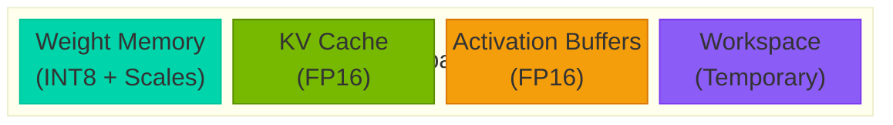
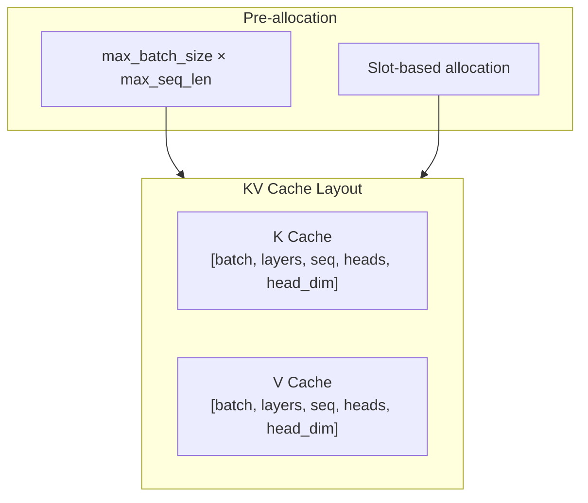

# Memory Model

Memory layout and management in Tiny-LLM.

## Overview

Tiny-LLM uses a carefully designed memory model to minimize GPU memory usage while maintaining high throughput.



---

## Weight Memory

### Quantized Weight Layout

Weights are stored in W8A16 format:

```mermaid
block-beta
    columns 3

    block:Layer["Per Transformer Layer"]
        W1["Q_proj: INT8<br/>[hidden, hidden]"]
        W2["K_proj: INT8<br/>[hidden, hidden]"]
        W3["V_proj: INT8<br/>[hidden, hidden]"]
    end

    block:Scales["Per-group Scales"]
        S1["Q_scales: FP16<br/>[hidden/128, hidden]"]
        S2["K_scales: FP16<br/>[hidden/128, hidden]"]
        S3["V_scales: FP16<br/>[hidden/128, hidden]"]
    end

    block:FFN["FFN Weights"]
        F1["gate_proj: INT8<br/>[hidden, intermediate]"]
        F2["up_proj: INT8<br/>[hidden, intermediate]"]
        F3["down_proj: INT8<br/>[intermediate, hidden]"]
    end
```



### Memory Calculation

For a 7B model with hidden_dim=4096, intermediate_dim=11008, num_layers=32:

| Component | Shape | INT8 Size | FP16 Size | Savings |
|-----------|-------|-----------|-----------|---------|
| Attention QKV | [3, 4096, 4096] | 150 MB | 300 MB | 50% |
| Attention Out | [4096, 4096] | 16 MB | 32 MB | 50% |
| FFN (gate+up+down) | [11008×2+4096, 4096] | 264 MB | 528 MB | 50% |
| **Per Layer** | — | **430 MB** | **860 MB** | **50%** |
| **Total (32 layers)** | — | **13.8 GB** | **27.5 GB** | **50%** |

---

## KV Cache Memory

### Cache Structure



### Cache Memory Calculation

For LLaMA-7B (32 layers, 32 heads, 128 head_dim):

| Context Length | Batch=1 | Batch=4 | Batch=8 |
|----------------|---------|---------|---------|
| 512 | 256 MB | 1.0 GB | 2.0 GB |
| 1024 | 512 MB | 2.0 GB | 4.0 GB |
| 2048 | 1.0 GB | 4.0 GB | 8.0 GB |
| 4096 | 2.0 GB | 8.0 GB | 16.0 GB |

---

## Activation Buffers

### Buffer Types

```cpp
struct ActivationBuffers {
    // Hidden states
    float* hidden;      // [batch, seq, hidden_dim]

    // Attention intermediate
    float* qkv;         // [batch, seq, 3, hidden_dim]
    float* attn_out;    // [batch, seq, hidden_dim]

    // FFN intermediate
    float* ffn_inter;   // [batch, seq, intermediate_dim]

    // Output
    float* logits;      // [batch, seq, vocab_size]
};
```

### Buffer Memory (7B Model, B=1, S=2048)

| Buffer | Shape | Size |
|--------|-------|------|
| Hidden States | [1, 2048, 4096] | 16 MB |
| QKV | [1, 2048, 12288] | 48 MB |
| FFN Intermediate | [1, 2048, 11008] | 44 MB |
| Logits | [1, 2048, 32000] | 250 MB |
| **Total** | — | **~360 MB** |

---

## Memory Management

### RAII Pattern

All GPU memory uses RAII for automatic cleanup:

```cpp
template<typename T>
class CudaBuffer {
    T* ptr_ = nullptr;
    size_t size_ = 0;

public:
    CudaBuffer(size_t size) : size_(size) {
        cudaMalloc(&ptr_, size * sizeof(T));
    }

    ~CudaBuffer() {
        if (ptr_) cudaFree(ptr_);
    }

    // Move-only (no copying)
    CudaBuffer(const CudaBuffer&) = delete;
    CudaBuffer& operator=(const CudaBuffer&) = delete;
    CudaBuffer(CudaBuffer&&) noexcept;
    CudaBuffer& operator=(CudaBuffer&&) noexcept;
};
```

### Stream-Ordered Allocation

```cpp
// Use CUDA streams for async allocation
cudaStream_t stream;
cudaStreamCreate(&stream);

// Stream-ordered malloc
cudaMallocAsync(&ptr, size, stream);

// Stream-ordered free
cudaFreeAsync(ptr, stream);
```

---

## Memory Optimization Strategies

### 1. Weight Quantization

```cpp
// Load INT8 weights instead of FP16
ModelConfig config;
config.quantization = QuantizationType::W8A16;
config.group_size = 128;  // Per-group scales
```

### 2. KV Cache Optimization

```cpp
// Limit cache size
KVCacheConfig cache_config;
cache_config.max_batch_size = 1;
cache_config.max_seq_len = 2048;  // Match your needs
```

### 3. Activation Recomputation

Trade compute for memory by recomputing activations:

```cpp
config.recompute_activations = true;
// Reduces activation memory by ~50%
```

### 4. Gradient Checkpointing

For training scenarios:

```cpp
config.gradient_checkpointing = true;
// Trade compute for memory during backward pass
```

---

## Memory Debugging

### Tracking Allocations

```cpp
// Enable memory tracking
#define CUDA_MEMORY_TRACKING 1

// Get allocation info
size_t free, total;
cudaMemGetInfo(&free, &total);
std::cout << "GPU Memory: " << (total - free) / 1024 / 1024
          << " MB / " << total / 1024 / 1024 << " MB" << std::endl;
```

### Memory Leaks

```bash
# Check for leaks
cuda-memcheck --tool memcheck ./build/bin/tinyllm-bench

# Or use compute sanitizer
compute-sanitizer --tool memcheck ./build/bin/tinyllm-bench
```

---

## Next Steps

- [Quantization](./quantization) - W8A16 implementation details
- [KV Cache](./kv-cache) - Cache management strategies
- [Performance](/en/performance/) - Memory impact on performance
