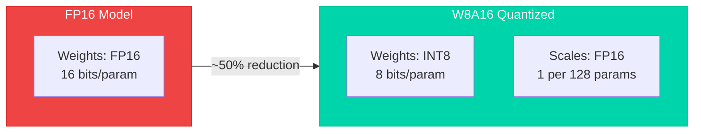
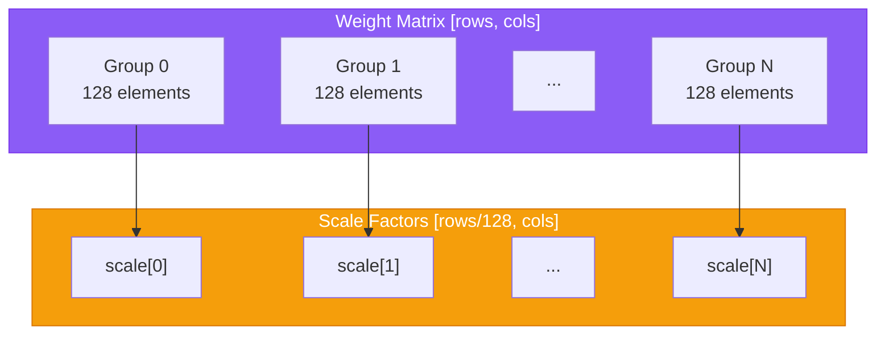
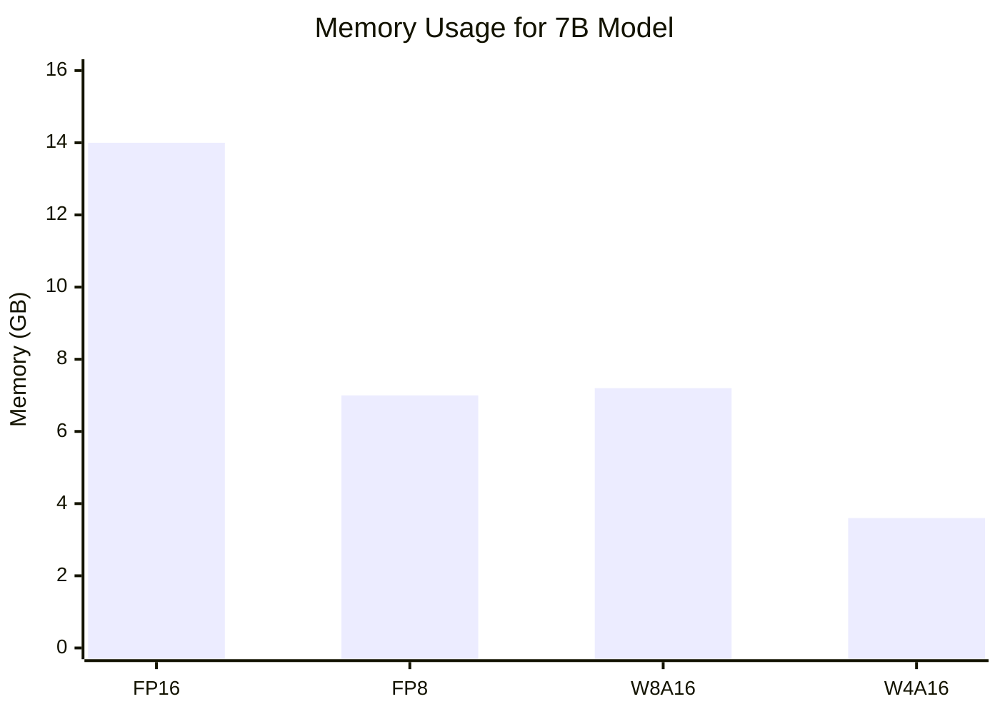
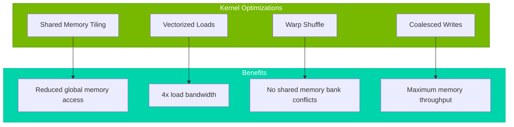
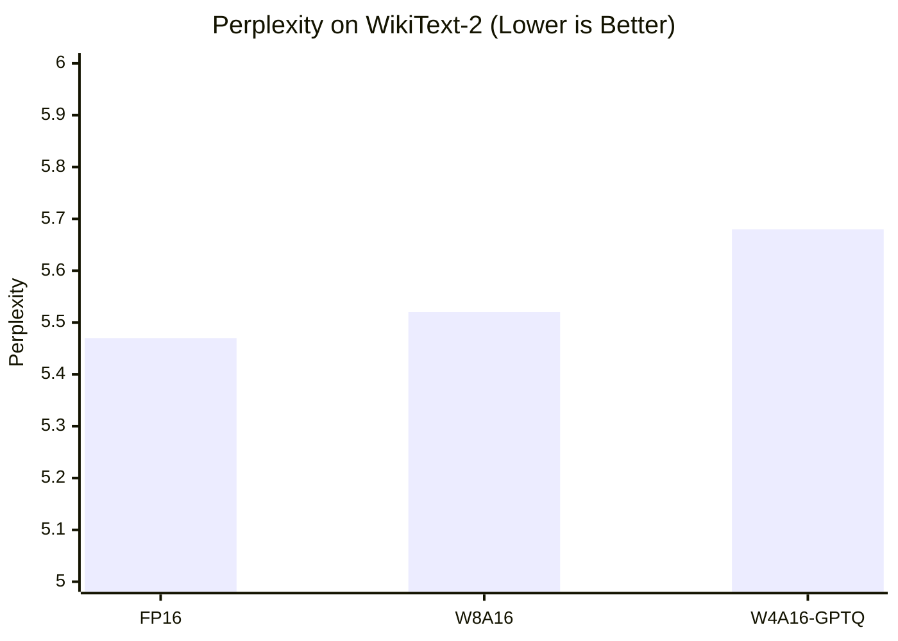
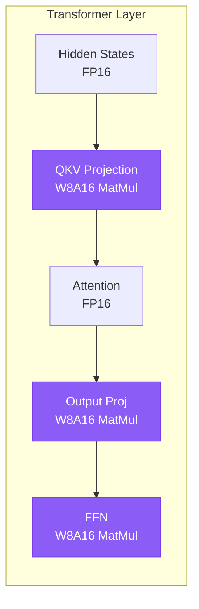

# W8A16 Quantization

Deep dive into the weight-only INT8 quantization implementation in Tiny-LLM.

## Overview

W8A16 (Weight-8-bit, Activation-16-bit) is a quantization scheme that stores weights in INT8 format while keeping activations in FP16. This provides significant memory savings while maintaining inference quality.



---

## Quantization Scheme

### Group-wise Quantization

Weights are divided into groups of 128 elements along the input dimension. Each group shares a scale factor.



### Mathematical Formulation

For a weight matrix $W \in \mathbb{R}^{M \times N}$:

$$W_q = \text{clamp}\left(\text{round}\left(\frac{W}{s}\right), -128, 127\right)$$

Where $s$ is the per-group scale factor:

$$s_g = \frac{\max(|W_g|)}{127}$$

Dequantization for computation:

$$\hat{W}_g = W_{q,g} \times s_g$$

---

## Memory Comparison



| Quantization | Weights | Activations | Total Memory | Quality Loss |
|--------------|---------|-------------|--------------|--------------|
| FP16 | 14.0 GB | FP16 | 14.0 GB | Baseline |
| FP8 | 7.0 GB | FP8 | 7.0 GB | Moderate |
| **W8A16** | 7.2 GB | FP16 | 7.2 GB | **Minimal** |
| W4A16 | 3.6 GB | FP16 | 3.6 GB | Noticeable |

---

## Kernel Implementation

### W8A16 Matrix Multiplication

```cpp
void w8a16_matmul(
    const half* input,      // [M, K] FP16
    const int8_t* weight,   // [K, N] INT8
    const half* scales,     // [K/128, N] FP16
    half* output,           // [M, N] FP16
    int M, int N, int K,
    int group_size = 128,
    cudaStream_t stream = 0);
```

### Optimization Techniques



#### Shared Memory Tiling

```cpp
// Load input tile to shared memory
__shared__ half input_tile[TILE_M][TILE_K];

// Vectorized load (128-bit = 8 FP16 values)
float4 vec = *reinterpret_cast<const float4*>(input + offset);
```

#### Warp Shuffle for Scale Broadcast

```cpp
// Broadcast scale to all threads in warp
float scale = __shfl_sync(0xffffffff, scales[scale_idx], 0);
```

---

## Quality Preservation

### Perplexity Comparison



### Why W8A16 Maintains Quality

1. **No Activation Quantization**: FP16 activations preserve precision in the computation chain
2. **Per-group Scaling**: Fine-grained scales adapt to weight distribution
3. **Tensor Core INT8**: Hardware-accelerated dequantization during computation

---

## Integration with Transformer Layers



---

## API Usage

### Loading Quantized Weights

```cpp
#include <tiny_llm/quantization.h>
#include <tiny_llm/model_loader.h>

// Load quantized weights from file
QuantizedWeight qweight;
qweight.rows = hidden_dim;
qweight.cols = hidden_dim;
qweight.group_size = 128;

// Allocate GPU memory
cudaMalloc(&qweight.data, qweight.weightBytes());
cudaMalloc(&qweight.scales, qweight.scaleBytes());

// Load from model file
model_loader.load_quantized_weight("q_proj", &qweight);
```

### Performing Quantized MatMul

```cpp
#include <tiny_llm/cuda_utils.h>

// W8A16 matrix multiplication
w8a16_matmul(
    input_fp16,      // [batch, seq, hidden]
    qweight.data,    // [hidden, hidden] INT8
    qweight.scales,  // [hidden/128, hidden] FP16
    output_fp16,     // [batch, seq, hidden]
    batch * seq_len, // M
    hidden_dim,      // N
    hidden_dim,      // K
    128,             // group_size
    stream
);
```

---

## References

- [LLM.int8(): 8-bit Matrix Multiplication for Neural Networks at Scale](https://arxiv.org/abs/2208.07339) - Dettmers et al., NeurIPS 2022
- [GPTQ: Accurate Post-Training Quantization](https://arxiv.org/abs/2210.17323) - Frantar et al., ICLR 2023
