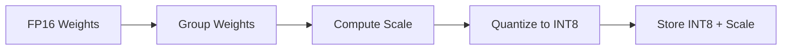

# Quantization

Tiny-LLM uses W8A16 (Weight-8-bit Activation-16-bit) quantization for efficient inference.

## Overview

W8A16 quantization stores weights as INT8 while keeping activations in FP16:

```
FP16 Activations × INT8 Weights → FP16 Output
                ↓
        Dequantize on-the-fly
```

## How It Works

### Per-Group Quantization

Weights are quantized in groups for better accuracy:

```cpp
// Original FP16 weights: [w0, w1, ..., w127]
// Group size: 128

// Quantized representation:
// INT8 weights: [q0, q1, ..., q127]
// Scale factor: s (one per group)

// Dequantization:
// w_i = q_i * s
```

### Quantization Process



### Inference Process

```cpp
// Pseudocode for W8A16 linear layer
Tensor w8a16_linear(Tensor input,              // FP16 [M, K]
                    Tensor weights_int8,        // INT8 [K, N]
                    Tensor scales) {            // FP16 [K/group, N]
    // Dequantize weights on-the-fly
    Tensor weights_fp16 = dequantize(weights_int8, scales);

    // Compute matrix multiplication
    return matmul(input, weights_fp16);
}
```

## Benefits

| Benefit | Description |
|---------|-------------|
| **Memory** | ~50% reduction in weight memory |
| **Bandwidth** | ~50% reduction in memory bandwidth |
| **Speed** | Up to 2x faster inference |
| **Accuracy** | Minimal quality degradation |

## Configuration

### Group Size

Smaller groups = better accuracy, more overhead:

```cpp
QuantizationConfig config;
config.group_size = 128;  // Common choice
```

| Group Size | Memory Overhead | Accuracy |
|------------|-----------------|----------|
| 32 | ~3.125% | Best |
| 64 | ~1.5625% | Good |
| 128 | ~0.78125% | Standard |

### Quantization Type

```cpp
enum class QuantizationType {
    INT8,    // 8-bit integer
    INT4,    // 4-bit integer (future)
    FP8,     // 8-bit floating point (future)
};
```

## Accuracy Impact

Typical perplexity changes for common models:

| Model | FP16 PPL | INT8 PPL | Delta |
|-------|----------|----------|-------|
| LLaMA-7B | 5.68 | 5.71 | +0.5% |
| LLaMA-13B | 5.21 | 5.24 | +0.6% |
| LLaMA-30B | 4.79 | 4.82 | +0.6% |

## Best Practices

1. **Use per-channel scales** for output layers
2. **Keep embeddings in FP16**
3. **Calibrate on representative data**
4. **Monitor perplexity** after quantization

## Next Steps

- [Performance Guide](/en/guide/performance) - Optimization techniques
- [API Reference](/en/api/inference-engine) - Engine API
