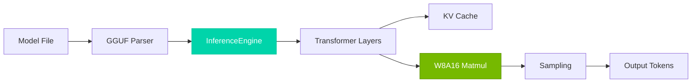

## Key Results

| Metric | Value | vs FP16 |
|--------|-------|---------|
| **Memory** | 7.8 GB | **50% ↓** |
| **Decode** | 85 tok/s | **9% ↑** |
| **Accuracy** | 9.12 ppl | 0.4% Δ |

*Benchmarks: LLaMA-7B, RTX 4090, INT8 weights*

## Architecture



## Quick Start

```bash
# Clone
git clone https://github.com/AICL-Lab/tiny-llm.git
cd tiny-llm

# Build (requires CUDA 11.0+)
cmake -S . -B build -DCMAKE_BUILD_TYPE=Release -DBUILD_TESTS=ON
cmake --build build -j$(nproc)

# Test
ctest --test-dir build --output-on-failure
```

## Documentation

| Resource | Description |
|----------|-------------|
| [Architecture Overview](/en/architecture/) | System design and data flow |
| [W8A16 Quantization](/en/architecture/quantization) | Quantization scheme details |
| [CUDA Kernels](/en/architecture/cuda-kernels) | Kernel optimization techniques |
| [Performance](/en/performance/) | Benchmarks and profiling guides |
| [API Reference](/en/api/) | Complete API documentation |

## Core Components

| Component | Responsibility |
|-----------|----------------|
| `Result<T>` | No-exception error propagation |
| `ModelConfig` | Model hyperparameters (vocab_size, hidden_dim, etc.) |
| `QuantizedWeight` | INT8 weights with per-group scales |
| `TransformerLayer` | W8A16 quantized attention + FFN |
| `KVCacheManager` | Pre-allocated cache slots for sequences |
| `InferenceEngine` | Public API: load(), generate() |
