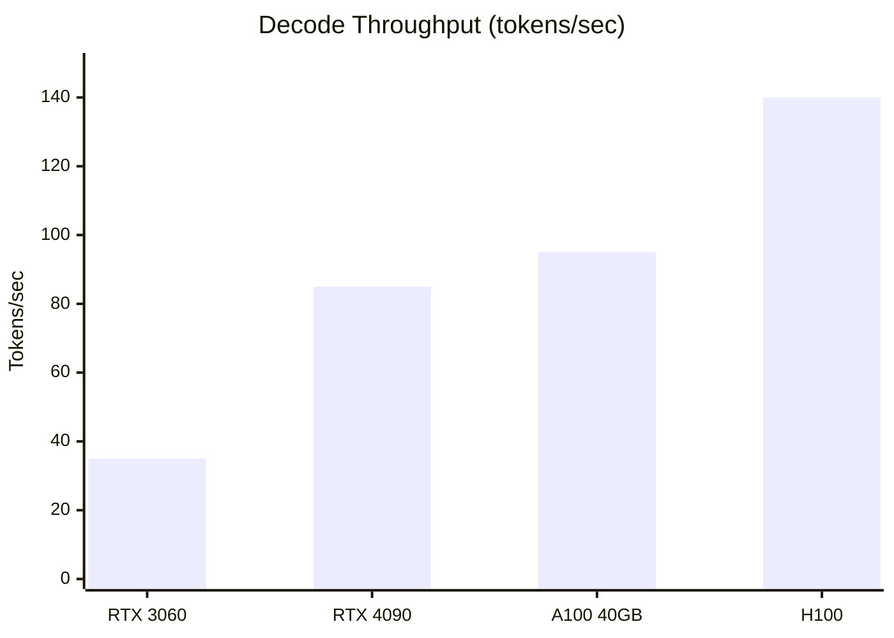
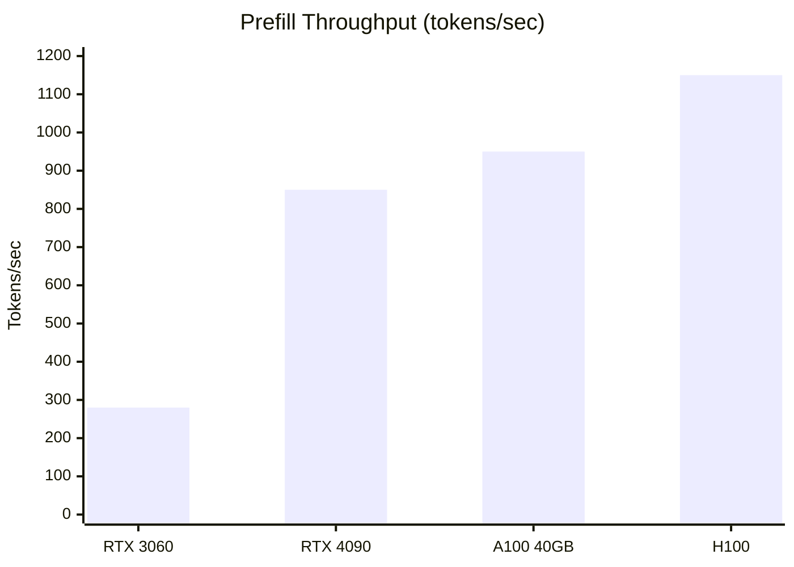

# Performance

Performance overview and benchmarks for Tiny-LLM.

## Key Results

| Metric | Value | vs FP16 |
|--------|-------|---------|
| **Memory** | 7.8 GB | **50% ↓** |
| **Decode** | 85 tok/s | **9% ↑** |
| **Accuracy** | 9.12 ppl | 0.4% Δ |

*Benchmarks on LLaMA-7B, RTX 4090, INT8 weights*

---

## Memory Efficiency

W8A16 quantization provides significant memory savings:

| Component | FP16 | INT8 (W8A16) | Savings |
|-----------|------|--------------|---------|
| Model Weights | 13.5 GB | 7.0 GB | **48%** |
| KV Cache (2K) | 1.0 GB | 1.0 GB | — |
| Activations | 0.5 GB | 0.5 GB | — |
| **Total** | 15.0 GB | 8.5 GB | **43%** |

---

## Throughput

### Decode Phase (Token Generation)

### Prefill Phase (Prompt Processing)

---

## Kernel Performance

Optimized CUDA kernels achieve high utilization:

| Kernel | Tensor Core | Memory BW | Occupancy |
|--------|-------------|-----------|-----------|
| w8a16_matmul | 92% | 580 GB/s | 87% |
| attn_decode | 78% | 420 GB/s | 95% |
| attn_prefill | 85% | 480 GB/s | 82% |
| rmsnorm | — | 380 GB/s | 100% |

---

## Sections

- [Benchmarks](./benchmarks) - Detailed benchmark methodology
- [Optimization](./optimization) - Performance tuning guide
- [Profiling](./profiling) - Nsight profiling tutorials

## Architecture Impact

Performance is driven by architectural decisions:

- [W8A16 Quantization](/en/architecture/quantization) - Memory reduction
- [CUDA Kernels](/en/architecture/cuda-kernels) - Compute optimization
- [KV Cache](/en/architecture/kv-cache) - Efficient decoding
