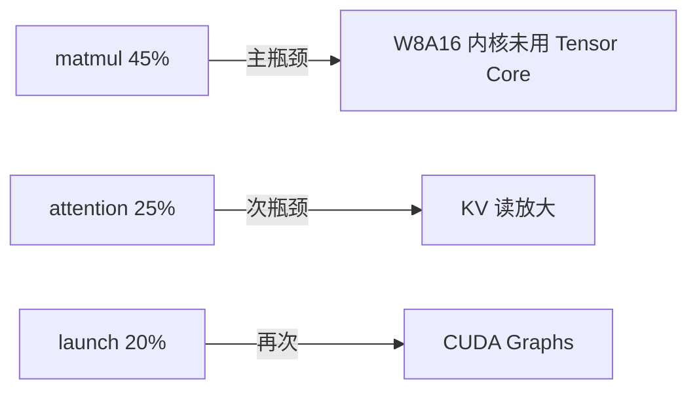

# Profiling / Benchmark 结果归档模板

> 每个报告一个文件：`results/<YYYY-MM-DD>-<gpu型号>.md`。
> 提交到仓库的只有 markdown 摘要；原始 `.nsys-rep` / `.ncu-rep` / 日志
> 放仓库外（git-lfs 或本地 `reports/`，见 DEVELOPMENT_PLAN.md 风险区）。

## 1. 元信息

| 项 | 值 |
|----|-----|
| 日期 | YYYY-MM-DD |
| 作者 | |
| GPU | （型号 / 显存 / 驱动版本） |
| CUDA Toolkit | （`nvcc --version`） |
| tiny-llm commit | （`git rev-parse HEAD`） |
| 工作区状态 | clean；若为 dirty 必须记录 `git diff --binary | sha256sum`，且不得当 release 数字 |
| benchmark schema | v2 |
| llama.cpp commit（如对比） | |
| 模型 | Qwen2.5-0.5B-Instruct GGUF Q4_K_M |
| 原始日志路径 | `reports/<name>.nsys-rep`、`reports/<name>.ncu-rep`、stdout 重定向文件 |

## 2. 复现命令（完整记录）

```bash
# 完整命令，保证可复现
./build/tiny_llm_bench <model> --prompt "你好" --max-tokens 64 --warmup 3 --iters 10
nsys profile -o reports/decode ./build/tiny_llm_bench ...
ncu --set full --launch-count 3 --launch-skip 10 ./build/tiny_llm_bench ...
```

## 3. 结果

### 3.1 端到端指标

| 指标 | 值 |
|------|-----|
| TTFT (ms) | |
| TPOT (ms/token) | |
| decode tok/s | |
| 常驻显存差值 (MB) | （加载前 vs 运行后；非真实峰值） |

### 3.2 kernel 时间分布

| 类别 | 总耗时 (ms) | 占比 |
|------|------------|------|
| matmul (w8a16/fp16) | | |
| attention | | |
| rmsnorm | | |
| rope | | |
| elementwise | | |
| memcpy | | |

### 3.3 关键 kernel 明细

| kernel | 调用次数 | 平均 (µs) | 总 (ms) | 占比 | 备注 |
|--------|---------|----------|--------|------|------|
| | | | | | |

### 3.4 decode launch 统计

| 项 | 值 |
|----|-----|
| decode step 平均 launch 数 | |
| 单 launch 平均开销（若可测） | |

## 4. 瓶颈结论（Top 3）

1. **瓶颈 A**：证据（数据引用）→ 归因 → 建议优化。
2. **瓶颈 B**：证据 → 归因 → 建议优化。
3. **瓶颈 C**：证据 → 归因 → 建议优化。

### 瓶颈图（建议）



## 5. 前后对比（如适用）

| 指标 | 优化前 | 优化后 | 变化 |
|------|--------|--------|------|
| TPOT (ms) | | | |
| decode tok/s | | | |

## 6. 复现核对

- [ ] 命令可原样执行
- [ ] 数字与原始日志一致
- [ ] 硬件 / commit / 命令已记录
- [ ] TTFT 与 TPOT 来自同一请求；JSON `cuda_graphs` 状态与实验组一致
- [ ] 若声称峰值显存，另有外部采样器/profiler 与采样频率，不把 resident delta 冒充峰值
