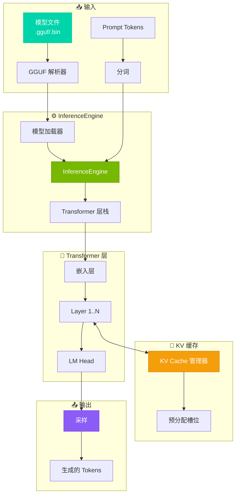
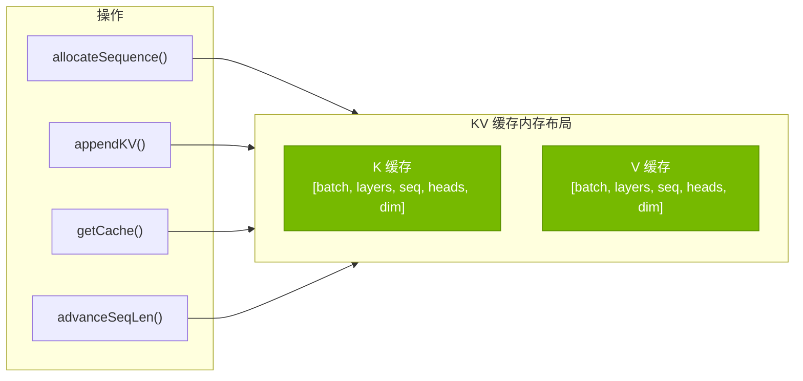
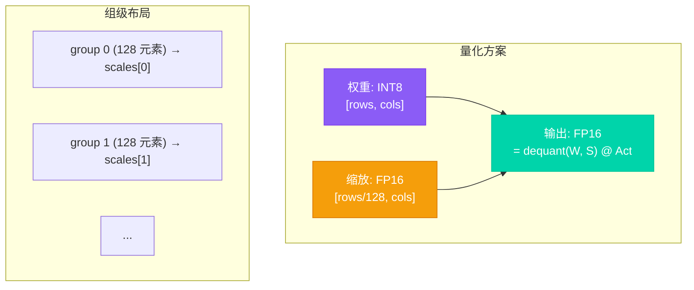
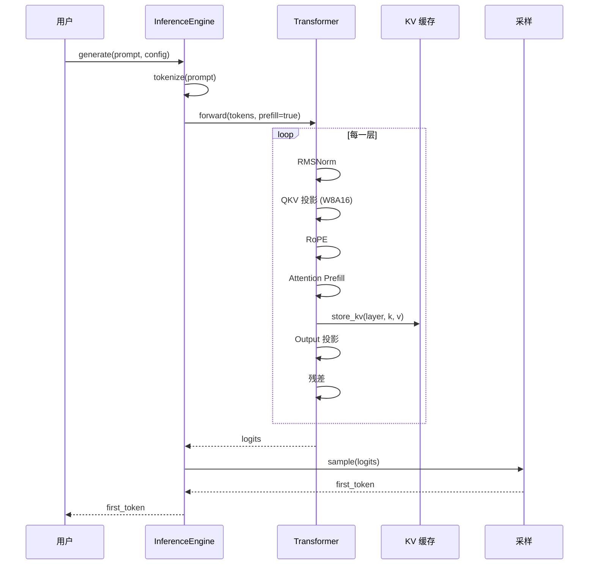
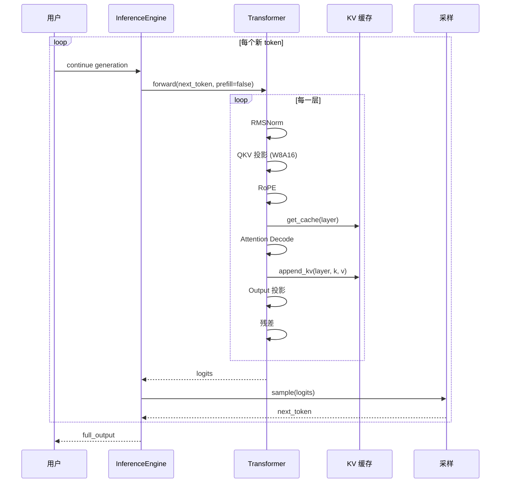
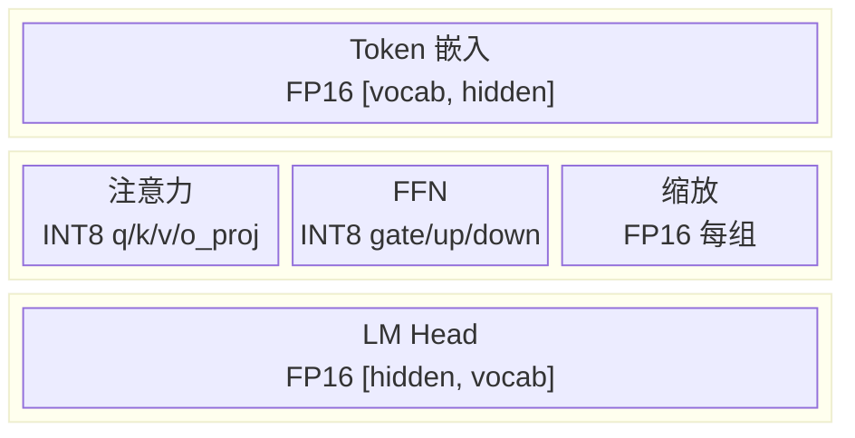
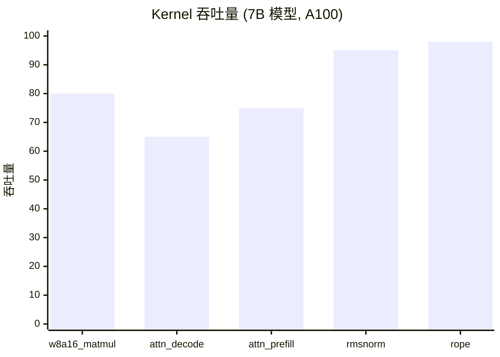
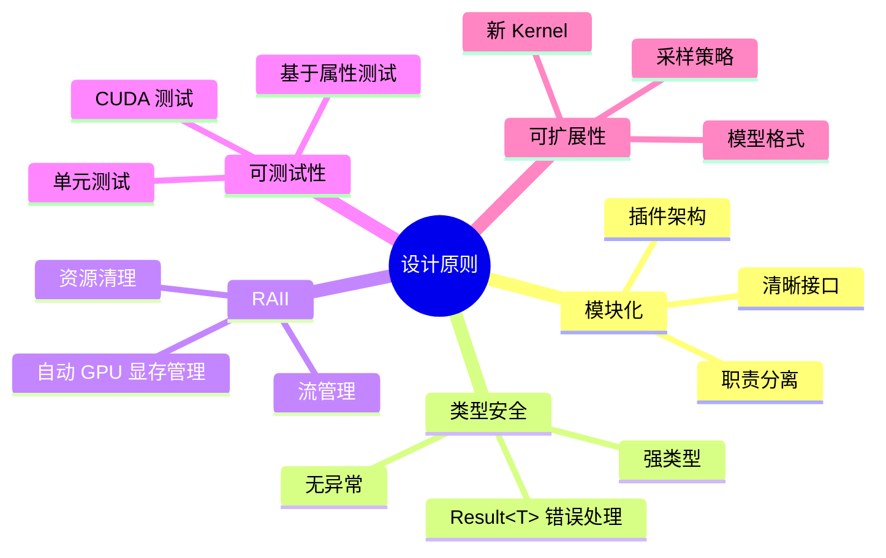

# 架构设计

Tiny-LLM 推理引擎的系统架构和设计文档。

## 概述

Tiny-LLM 是一个高性能 CUDA C++ 推理引擎，专为高效的 Transformer 模型推理而设计。其核心特性包括：

| 特性 | 技术 | 收益 |
|---------|------------|---------|
| **W8A16 量化** | INT8 权重 + FP16 激活 | 显存减少约 50% |
| **高效 KV 缓存** | 增量解码与序列管理 | O(1) 自回归步进 |
| **优化 Kernel** | Tensor Core INT8、共享内存 tiling | 最大吞吐 |
| **模块化设计** | 清晰职责分离 | 易于扩展和测试 |

---

## 系统架构



---

## 核心组件

### 1. InferenceEngine

模型推理的主入口。

```cpp
class InferenceEngine {
public:
    // 从磁盘加载模型
    static Result\<std::unique_ptr\<InferenceEngine\>\> load(
        const std::string& path, const ModelConfig& config);
    
    // 完整的生成流程
    std::vector<int> generate(
        const std::vector<int>& prompt, 
        const GenerationConfig& config);
    
    // 统计和性能分析
    const GenerationStats& getStats() const;
    void resetStats();
};
```

**核心职责**:
- 模型生命周期管理
- Prefill/decode 编排
- Token 采样和生成循环
- 性能分析

### 2. KV Cache 管理器

用于自回归生成的高效键值缓存。



### 3. W8A16 量化

仅权重的 INT8 量化，使用 FP16 激活。



**优势**:
- 权重显存减少 50%
- 不量化激活 (保持精度)
- Ampere+ 上高效的 INT8 Tensor Core 利用

---

## 数据流

### Prefill 阶段 (Prompt 处理)



### Decode 阶段 (Token 生成)



---

## 内存布局

### 权重存储



### 激活缓存

| 缓存 | 形状 | 数据类型 | 大小 (B=1, S=2048, H=4096) |
|--------|-------|-------|---------------------------|
| 隐藏状态 | [B, S, H] | FP16 | 16 MB |
| 注意力输出 | [B, heads, S, head_dim] | FP16 | 16 MB |
| QKV | [B, S, 3×H] | FP16 | 48 MB |
| FFN 中间结果 | [B, S, intermediate_dim] | FP16 | 44 MB |

---

## 性能优化

### 内存优化

| 技术 | 实现 | 收益 |
|-----------|----------------|---------|
| W8A16 量化 | 每组 INT8 权重 + FP16 缩放 | 权重显存减少 50% |
| KV Cache 分页 | 预分配 + 序列管理 | 高效批处理 |
| 激活复用 | 原地操作 | 减少分配 |

### 计算优化

| 技术 | 应用 | 加速比 |
|-----------|-------------|---------|
| Tensor Cores | INT8 矩阵乘 (Ampere+) | 2-4× vs FP16 |
| Warp Shuffle | 归约 | 消除共享内存 |
| 向量化加载 | 128-bit 内存访问 | 更好带宽 |
| Kernel 融合 | RMSNorm+Resid, SiLU+Mul | 减少内核启动 |

### Kernel 性能



---

## 设计原则



---

## 下一步

- [量化详解](./quantization) - W8A16 实现深入解析
- [KV 缓存](./kv-cache) - 缓存管理策略
- [CUDA Kernel](./cuda-kernels) - Kernel 优化技术
- [API 参考](../api/inference-engine) - 完整 API 文档
