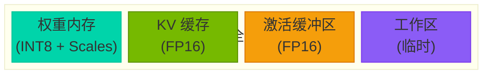
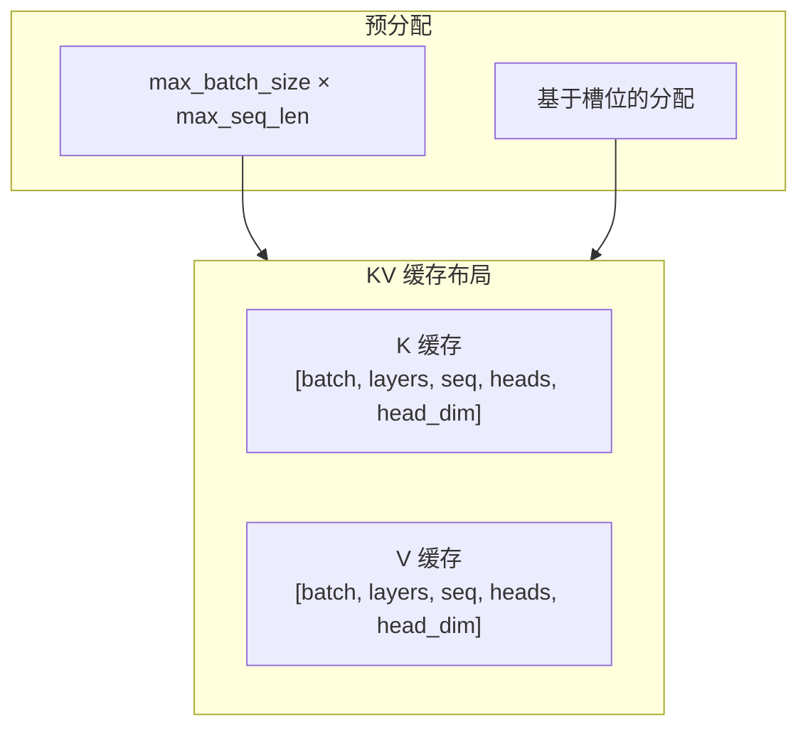

# 内存模型

Tiny-LLM 的内存布局和管理。

## 概述

Tiny-LLM 使用精心设计的内存模型，在保持高吞吐量的同时最小化 GPU 内存使用。



---

## 权重内存

### 量化权重布局

权重以 W8A16 格式存储：

```mermaid
block-beta
    columns 3

    block:Layer["每个 Transformer 层"]
        W1["Q_proj: INT8<br/>[hidden, hidden]"]
        W2["K_proj: INT8<br/>[hidden, hidden]"]
        W3["V_proj: INT8<br/>[hidden, hidden]"]
    end

    block:Scales["每组 Scales"]
        S1["Q_scales: FP16<br/>[hidden/128, hidden]"]
        S2["K_scales: FP16<br/>[hidden/128, hidden]"]
        S3["V_scales: FP16<br/>[hidden/128, hidden]"]
    end

    block:FFN["FFN 权重"]
        F1["gate_proj: INT8<br/>[hidden, intermediate]"]
        F2["up_proj: INT8<br/>[hidden, intermediate]"]
        F3["down_proj: INT8<br/>[intermediate, hidden]"]
    end
```



### 内存计算

对于 hidden_dim=4096, intermediate_dim=11008, num_layers=32 的 7B 模型：

| 组件 | 形状 | INT8 大小 | FP16 大小 | 节省 |
|------|------|-----------|-----------|------|
| Attention QKV | [3, 4096, 4096] | 150 MB | 300 MB | 50% |
| Attention Out | [4096, 4096] | 16 MB | 32 MB | 50% |
| FFN (gate+up+down) | [11008×2+4096, 4096] | 264 MB | 528 MB | 50% |
| **每层** | — | **430 MB** | **860 MB** | **50%** |
| **总计 (32层)** | — | **13.8 GB** | **27.5 GB** | **50%** |

---

## KV 缓存内存

### 缓存结构



### 缓存内存计算

对于 LLaMA-7B（32 层, 32 头, 128 head_dim）：

| 上下文长度 | Batch=1 | Batch=4 | Batch=8 |
|------------|---------|---------|---------|
| 512 | 256 MB | 1.0 GB | 2.0 GB |
| 1024 | 512 MB | 2.0 GB | 4.0 GB |
| 2048 | 1.0 GB | 4.0 GB | 8.0 GB |
| 4096 | 2.0 GB | 8.0 GB | 16.0 GB |

---

## 激活缓冲区

### 缓冲区类型

```cpp
struct ActivationBuffers {
    // 隐藏状态
    float* hidden;      // [batch, seq, hidden_dim]

    // Attention 中间值
    float* qkv;         // [batch, seq, 3, hidden_dim]
    float* attn_out;    // [batch, seq, hidden_dim]

    // FFN 中间值
    float* ffn_inter;   // [batch, seq, intermediate_dim]

    // 输出
    float* logits;      // [batch, seq, vocab_size]
};
```

### 缓冲区内存（7B 模型, B=1, S=2048）

| 缓冲区 | 形状 | 大小 |
|--------|------|------|
| 隐藏状态 | [1, 2048, 4096] | 16 MB |
| QKV | [1, 2048, 12288] | 48 MB |
| FFN 中间值 | [1, 2048, 11008] | 44 MB |
| Logits | [1, 2048, 32000] | 250 MB |
| **总计** | — | **~360 MB** |

---

## 内存管理

### RAII 模式

所有 GPU 内存使用 RAII 进行自动清理：

```cpp
template<typename T>
class CudaBuffer {
    T* ptr_ = nullptr;
    size_t size_ = 0;

public:
    CudaBuffer(size_t size) : size_(size) {
        cudaMalloc(&ptr_, size * sizeof(T));
    }

    ~CudaBuffer() {
        if (ptr_) cudaFree(ptr_);
    }

    // 仅移动（禁止复制）
    CudaBuffer(const CudaBuffer&) = delete;
    CudaBuffer& operator=(const CudaBuffer&) = delete;
    CudaBuffer(CudaBuffer&&) noexcept;
    CudaBuffer& operator=(CudaBuffer&&) noexcept;
};
```

### 流序分配

```cpp
// 使用 CUDA 流进行异步分配
cudaStream_t stream;
cudaStreamCreate(&stream);

// 流序 malloc
cudaMallocAsync(&ptr, size, stream);

// 流序 free
cudaFreeAsync(ptr, stream);
```

---

## 内存优化策略

### 1. 权重量化

```cpp
// 加载 INT8 权重而不是 FP16
ModelConfig config;
config.quantization = QuantizationType::W8A16;
config.group_size = 128;  // 每组 scales
```

### 2. KV 缓存优化

```cpp
// 限制缓存大小
KVCacheConfig cache_config;
cache_config.max_batch_size = 1;
cache_config.max_seq_len = 2048;  // 根据需求设置
```

### 3. 激活重计算

通过重计算激活值来节省内存：

```cpp
config.recompute_activations = true;
// 减少约 50% 的激活内存
```

---

## 内存调试

### 追踪分配

```cpp
// 启用内存追踪
#define CUDA_MEMORY_TRACKING 1

// 获取分配信息
size_t free, total;
cudaMemGetInfo(&free, &total);
std::cout << "GPU 内存: " << (total - free) / 1024 / 1024
          << " MB / " << total / 1024 / 1024 << " MB" << std::endl;
```

### 内存泄漏

```bash
# 检查泄漏
cuda-memcheck --tool memcheck ./build/bin/tinyllm-bench

# 或使用 compute sanitizer
compute-sanitizer --tool memcheck ./build/bin/tinyllm-bench
```

---

## 下一步

- [量化](./quantization) - W8A16 实现细节
- [KV 缓存](./kv-cache) - 缓存管理策略
- [性能](/zh/performance/) - 内存对性能的影响
