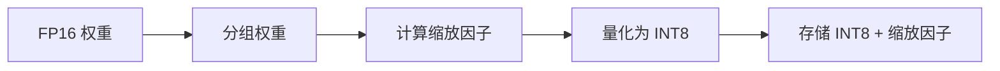

# 量化

Tiny-LLM 使用 W8A16（权重 8 位，激活值 16 位）量化实现高效推理。

## 概述

W8A16 量化将权重存储为 INT8，同时保持激活值为 FP16：

```
FP16 激活值 × INT8 权重 → FP16 输出
                ↓
        即时反量化
```

## 工作原理

### 分组量化

权重按组进行量化以获得更好的精度：

```cpp
// 原始 FP16 权重: [w0, w1, ..., w127]
// 组大小: 128

// 量化表示:
// INT8 权重: [q0, q1, ..., q127]
// 缩放因子: s（每组一个）

// 反量化:
// w_i = q_i * s
```

### 量化过程



### 推理过程

```cpp
// W8A16 线性层伪代码
Tensor w8a16_linear(Tensor input,              // FP16 [M, K]
                    Tensor weights_int8,        // INT8 [K, N]
                    Tensor scales) {            // FP16 [K/group, N]
    // 即时反量化权重
    Tensor weights_fp16 = dequantize(weights_int8, scales);

    // 计算矩阵乘法
    return matmul(input, weights_fp16);
}
```

## 优势

| 优势 | 描述 |
|------|------|
| **内存** | 权重内存减少约 50% |
| **带宽** | 内存带宽减少约 50% |
| **速度** | 推理速度提升高达 2 倍 |
| **精度** | 极小的质量下降 |

## 配置

### 组大小

更小的组 = 更好的精度，更多开销：

```cpp
QuantizationConfig config;
config.group_size = 128;  // 常见选择
```

| 组大小 | 内存开销 | 精度 |
|--------|----------|------|
| 32 | ~3.125% | 最佳 |
| 64 | ~1.5625% | 良好 |
| 128 | ~0.78125% | 标准 |

### 量化类型

```cpp
enum class QuantizationType {
    INT8,    // 8 位整数
    INT4,    // 4 位整数（未来支持）
    FP8,     // 8 位浮点（未来支持）
};
```

## 精度影响

常见模型的典型困惑度变化：

| 模型 | FP16 困惑度 | INT8 困惑度 | 变化 |
|------|-------------|-------------|------|
| LLaMA-7B | 5.68 | 5.71 | +0.5% |
| LLaMA-13B | 5.21 | 5.24 | +0.6% |
| LLaMA-30B | 4.79 | 4.82 | +0.6% |

## 最佳实践

1. **对输出层使用逐通道缩放**
2. **将嵌入层保持为 FP16**
3. **在代表性数据上进行校准**
4. **量化后监控困惑度**

## 下一步

- [性能指南](/zh/performance/optimization) - 优化技术
- [API 参考](/zh/api/inference-engine) - 引擎 API
