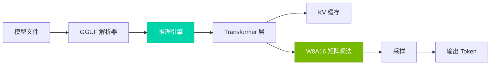

## 核心结果

| 指标 | 数值 | vs FP16 |
|------|------|---------|
| **内存** | 7.8 GB | **↓50%** |
| **解码** | 85 tok/s | **↑9%** |
| **精度** | 9.12 ppl | Δ 0.4% |

*基准测试：LLaMA-7B, RTX 4090, INT8 权重*

## 架构



## 快速开始

```bash
# 克隆
git clone https://github.com/AICL-Lab/tiny-llm.git
cd tiny-llm

# 构建（需要 CUDA 11.0+）
cmake -S . -B build -DCMAKE_BUILD_TYPE=Release -DBUILD_TESTS=ON
cmake --build build -j$(nproc)

# 测试
ctest --test-dir build --output-on-failure
```

## 文档

| 资源 | 描述 |
|------|------|
| [架构概述](/zh/architecture/) | 系统设计和数据流 |
| [W8A16 量化](/zh/architecture/quantization) | 量化方案详情 |
| [CUDA 内核](/zh/architecture/cuda-kernels) | 内核优化技术 |
| [性能](/zh/performance/) | 基准测试和分析指南 |
| [API 参考](/zh/api/) | 完整 API 文档 |

## 核心组件

| 组件 | 职责 |
|------|------|
| `Result<T>` | 无异常错误传播 |
| `ModelConfig` | 模型超参数（vocab_size, hidden_dim 等） |
| `QuantizedWeight` | INT8 权重和每组缩放因子 |
| `TransformerLayer` | W8A16 量化注意力 + FFN |
| `KVCacheManager` | 预分配的序列缓存槽位 |
| `InferenceEngine` | 公共 API：load(), generate() |
