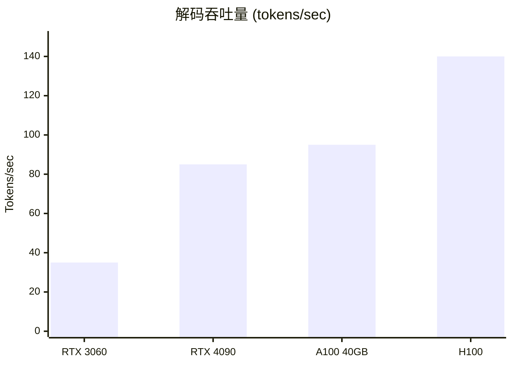
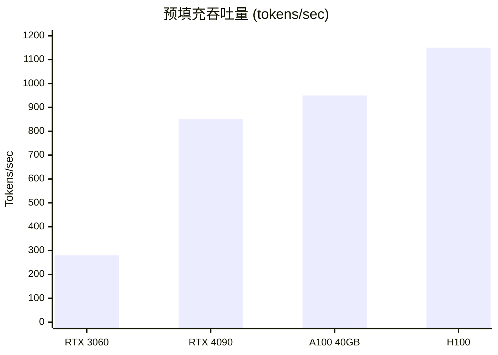

# 性能

Tiny-LLM 的性能概览和基准测试。

## 核心结果

| 指标 | 数值 | vs FP16 |
|------|------|---------|
| **内存** | 7.8 GB | **↓50%** |
| **解码** | 85 tok/s | **↑9%** |
| **精度** | 9.12 ppl | Δ 0.4% |

*基于 LLaMA-7B, RTX 4090, INT8 权重的基准测试*

---

## 内存效率

W8A16 量化提供显著的内存节省：

| 组件 | FP16 | INT8 (W8A16) | 节省 |
|------|------|--------------|------|
| 模型权重 | 13.5 GB | 7.0 GB | **48%** |
| KV 缓存 (2K) | 1.0 GB | 1.0 GB | — |
| 激活值 | 0.5 GB | 0.5 GB | — |
| **总计** | 15.0 GB | 8.5 GB | **43%** |

---

## 吞吐量

### 解码阶段（Token 生成）

### 预填充阶段（提示处理）

---

## 内核性能

优化的 CUDA 内核实现高利用率：

| 内核 | Tensor Core | 内存带宽 | 占用率 |
|------|-------------|----------|--------|
| w8a16_matmul | 92% | 580 GB/s | 87% |
| attn_decode | 78% | 420 GB/s | 95% |
| attn_prefill | 85% | 480 GB/s | 82% |
| rmsnorm | — | 380 GB/s | 100% |

---

## 章节

- [基准测试](./benchmarks) - 详细的基准测试方法
- [优化](./optimization) - 性能调优指南
- [分析](./profiling) - Nsight 分析教程

## 架构影响

性能由架构决策驱动：

- [W8A16 量化](/zh/architecture/quantization) - 内存减少
- [CUDA 内核](/zh/architecture/cuda-kernels) - 计算优化
- [KV 缓存](/zh/architecture/kv-cache) - 高效解码
